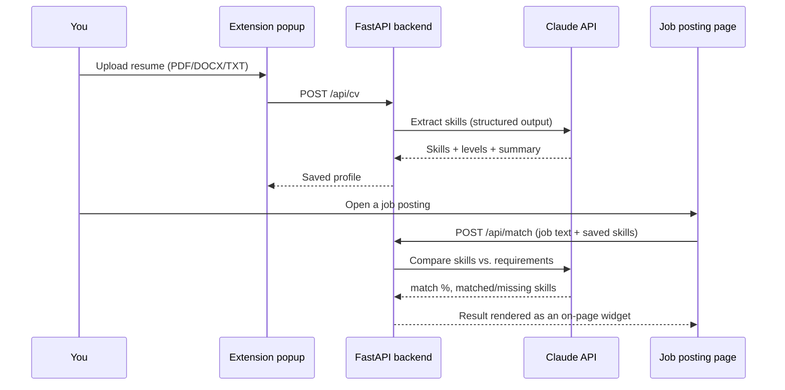

# JobRate

A browser extension that reads your resume, then rates how well any job
posting you're viewing matches your skills — instantly, right on the page.

<!--
  Add a screenshot or short GIF here once you've got one, e.g.:
  
  
-->

## How it works



Skill extraction and job matching are both done by Claude (structured
outputs via `client.messages.parse()` + Pydantic schemas) — it understands
synonyms, related tools, and proficiency levels (e.g. a resume listing "C1
English" correctly satisfies a job requiring "fluent English"), rather than
doing literal keyword matching.

## Stack

- **Backend:** Python, FastAPI, SQLAlchemy, SQLite, Claude API (`anthropic` SDK)
- **Extension:** vanilla JS/HTML/CSS, Chrome/Edge Manifest V3 (no build step)

## Setup

### 1. Backend

```bash
cd backend
python -m venv venv
venv\Scripts\activate        # Windows
# source venv/bin/activate   # macOS/Linux

pip install -r requirements.txt
copy .env.example .env       # Windows; macOS/Linux: cp .env.example .env
```

Open `backend/.env` and add your key:

```
ANTHROPIC_API_KEY=sk-ant-...
```

Get a key at [console.anthropic.com](https://console.anthropic.com/) → API
Keys (top up your balance there too). The default model is `claude-sonnet-5`
— a good price/quality balance for this task; switch `ANTHROPIC_MODEL` in
`.env` to `claude-opus-5` for higher accuracy at a higher cost.

Run the server:

```bash
uvicorn app.main:app --reload --port 8000
```

Check [http://localhost:8000/health](http://localhost:8000/health) — should
return `{"status":"ok"}`. The SQLite database (`backend/jobrate.db`) is
created automatically on first run.

### 2. Extension

1. Open `chrome://extensions` (or `edge://extensions`)
2. Enable **Developer mode**
3. Click **Load unpacked**
4. Select the `extension/` folder

### 3. Usage

1. Click the JobRate icon → upload your resume (PDF/DOCX/TXT). Claude
   extracts your skills and shows them in the popup; you can also add/remove
   skills manually.
2. Open a job posting (LinkedIn, Indeed, etc.) — a widget appears in the
   bottom-right corner with a match percentage and two skill lists ("You
   have" / "Missing"). If it doesn't auto-appear, click **"Check this job
   posting"** in the popup to trigger it manually.

## Cost

This is a simple, cheap workload (structured extraction against a fixed JSON
schema) — even a $5 top-up covers many hundreds of job-match calls on
`claude-sonnet-5`. The resume is parsed once on upload; the ongoing cost is
`/api/match`, called once per job page you check.

## Testing

```bash
cd backend
pip install -r requirements-dev.txt
pytest
```

Tests mock the Claude API calls (`monkeypatch`), so they run instantly and
don't cost anything or require a real API key. They cover resume parsing,
profile CRUD, and the `/api/cv` / `/api/match` request/validation flow.

## Project structure

```
backend/
  app/
    routers/          # HTTP endpoints: /api/cv, /api/profile, /api/match
    services/
      llm.py           # Claude API calls (structured outputs, Pydantic schemas)
      resume_parser.py  # PDF/DOCX/TXT -> plain text
    models.py           # SQLAlchemy models (Profile, Skill, MatchHistory)
    schemas.py           # Pydantic request/response schemas
    main.py                # FastAPI entry point
  tests/                    # pytest suite (mocked LLM calls)
extension/
  manifest.json
  icons/                # extension icon (16/48/128px)
  background.js         # service worker: HTTP calls to the backend
  content.js             # detects job pages, extracts text, renders the widget
  popup.html/js/css       # resume upload, skill list, manual "check this job" trigger
scripts/
  generate_icons.py       # regenerates extension/icons/*.png
```

## Roadmap

- Site-specific job-text extractors (LinkedIn, Indeed, hh.ru) instead of the
  generic heuristic
- Multi-user support with authentication (currently one profile per backend
  instance)
- Surface match history in the popup (the `MatchHistory` table already
  records every check)
- Firefox build
- Cache identical matches (by job-text hash + profile version) to avoid
  re-spending tokens on repeat visits
- Deploy the backend so the extension works without running a local server

## License

[MIT](LICENSE)
